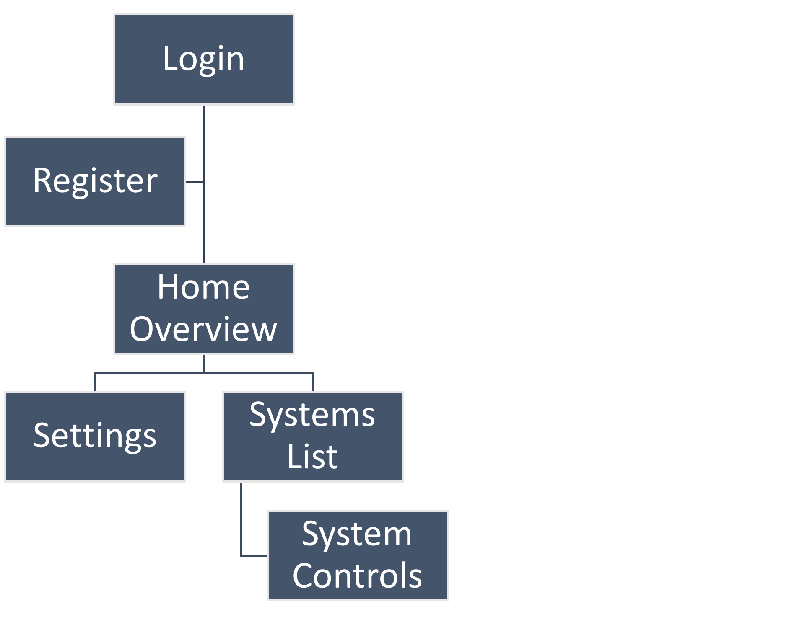

# Home Controller
This project is designed to control various home systems via an internet-connected interface. Its purpose is to turn internet-disconnected devices (i.e. “dumb devices”) into internet-connected devices (i.e. “smart devices”). At the time of writing this document, the current systems include the various sprinkler valves and the garage door. However, this project will enable easy additions for new systems.

## Goals

### Project Purpose:
- This project is designed to control various home systems via an internet-connected interface. Its purpose is to turn internet-disconnected devices (i.e. “dumb devices”) into internet-connected devices (i.e. “smart devices”). At the time of writing this document, the current systems include the various sprinkler valves and the garage door. However, this project will enable easy additions for new systems.

### Problems to be Solved:

- The primary problem at hand involves the pain point of manually controlling various home systems. Current systems do not offer remote control capabilities.
- Due to the limited and fixed feature set of these systems, dynamic functionality is largely impossible. If a feature is desired later, the current solution may not allow such a feature to be implemented.
- Each system has its own unique controller. This means the user is required to use multiple interfaces at different physical locations.

### How this Project Solves the Problems:
- By facilitating the controls of all home systems via an internet-connected system, the user can control everything remotely. Common tasks such as turning systems ON/OFF or monitoring the status become quick and easy.
- By using a software-defined interface, dynamic functionality is supported. This project will allow future updates to improve upon the feature set based on the user’s later requirements.
- A unified control interface means that the user must only worry about learning one interface instead of multiple.

## Sitemaps

### Main Application Sitemap:

## Functional Requirements

### Hardware Controller FRs:

| Requirement ID | Requirement Statement | Comments|
| ------ | ------ | ------ |
HFR001	| The controller shall keep track of the status of every connected system.	
HFR002	| The controller shall report the status of every connected system to a server.	
HFR003	| The controller shall support the addition or removal of any supported system.	
HFR004	| The controller shall support schedule-based actions for any connected systems. | This will probably require the device to fetch the current time from server on every boot-up.
HFR005 |	The controller shall apply system-specific actions based on instructions from a server.	| The initial “system-specific” actions will just include turning said system on/off.

### Application Controller FRs:

| Requirement ID | Requirement Statement | Comments|
| ------ | ------ | ------ |
AFR001	| The App shall display the status of connected systems.	
AFR002	| The App shall send actions to turn on/off connected systems.	
AFR003	| The App shall support time-based commands.	
AFR004	| The controller shall support schedule-based actions for any connected systems.	

## Non-Functional Requirements

### Hardware Controller NFRs:
- The controller will consist of an ESP8266 for Wi-Fi connection
- The controller will also consist of an additional Arduino device for extra pin outputs
- The controller must connect/interface with a Firebase backend
- The controller must save all relevant state data to flash memory in the event of an unexpected shutdown
- Likewise, the controller must load relevant state data from flash memory if any exists

### Application Controller NFRs:
- The app must be built using Electron framework
- The app should succinctly show the state of all connected systems
- The app should have a list of systems, organized by categories of system types
- The app should allow the user to use a date/time picker to set up automatic schedule-based actions
- The app should be responsive and constantly up to date with the latest status from the backend server

## Future Features
| Feature | Description|
| ------ | ------ |
Garage Door | Support	Add the ability to monitor the status of the garage door and open/close it on command.
Sprinkler Shutoff on Rain | A feature that will automatically turn off sprinklers when rain is detected. The sprinklers will not turn back on for X hours after the rain has subsided.

License
----

[//]: # (These are reference links used in the body of this note and get stripped out when the markdown processor does its job. There is no need to format nicely because it shouldn't be seen. Thanks SO - http://stackoverflow.com/questions/4823468/store-comments-in-markdown-syntax)

